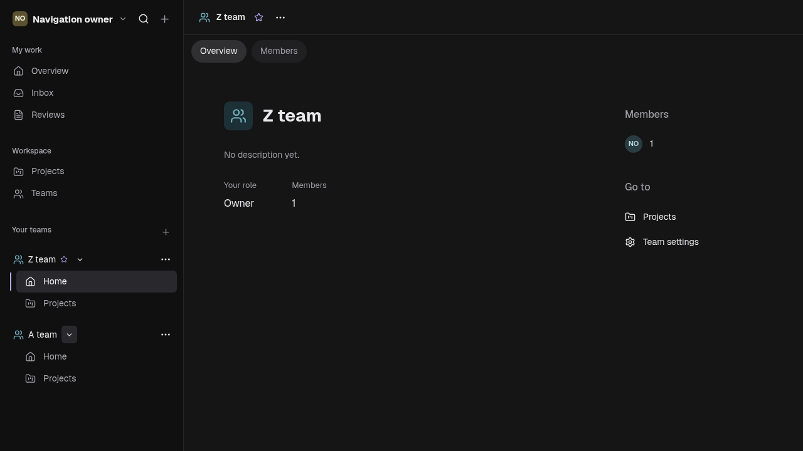
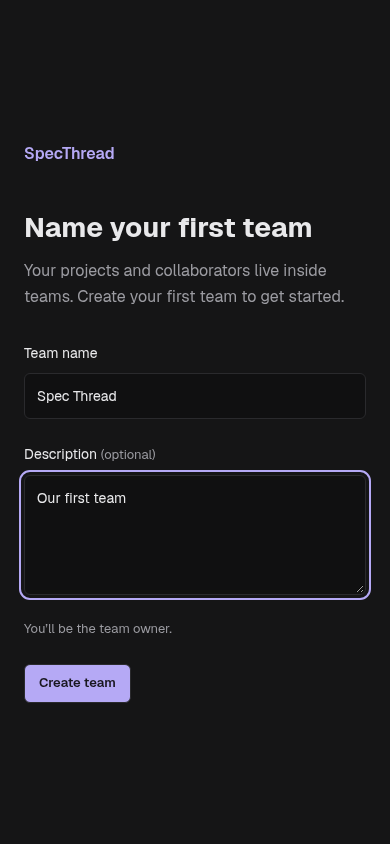
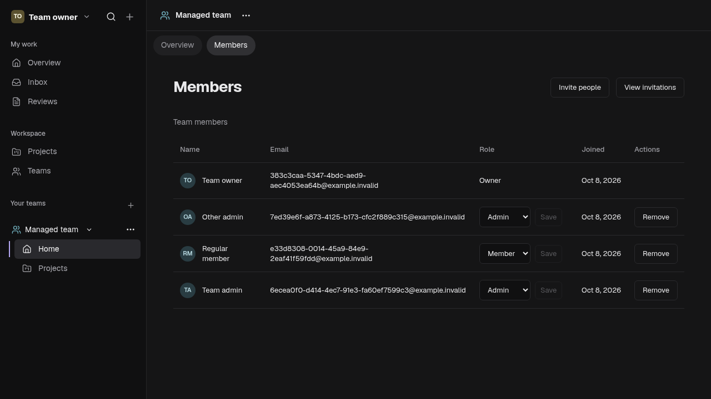
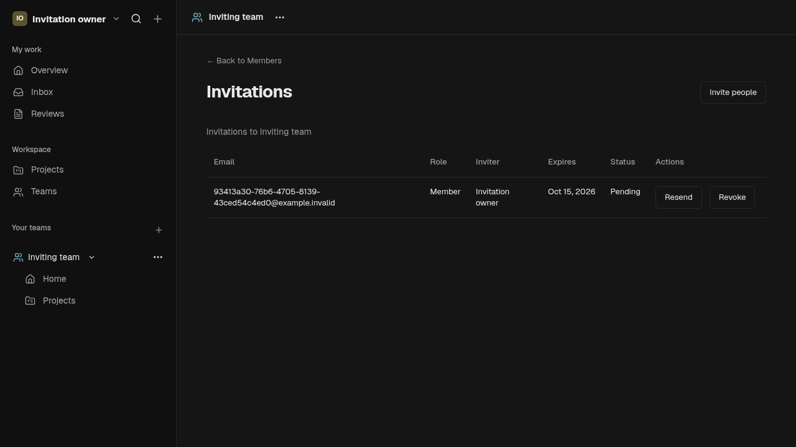
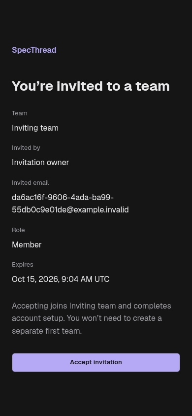
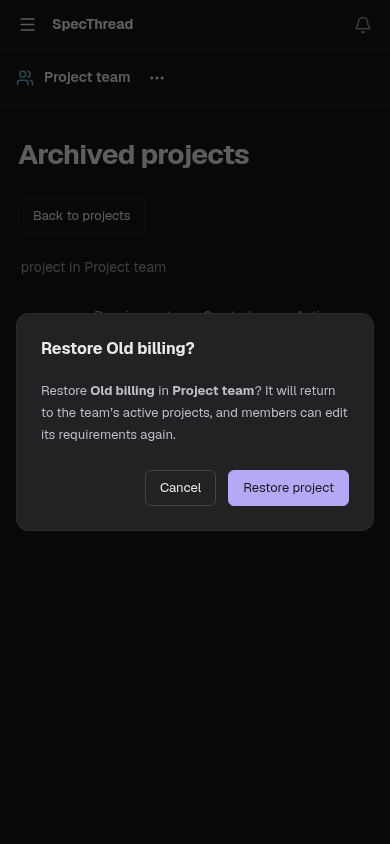

# Teams review screenshots

These screenshots were captured by the passing Playwright browser scenarios in
the cloud workspace using disposable PostgreSQL data and synthetic test accounts.
The application uses the existing shared styling; Claude's global project pages
remain a separate feature branch. No live account data or invitation secrets
appear in these images.

## Multiple teams and Team Home

## Required first-team onboarding

## Members and role controls

## Invitation management

## Invitation acceptance

## Archive restoration

